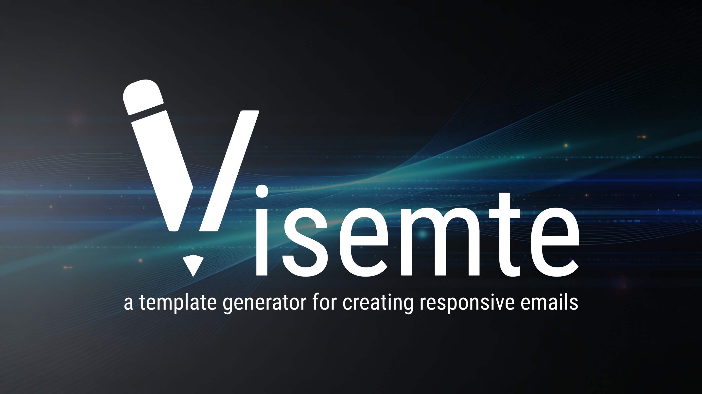

## Features

- **Editor** — create email templates visually by adding blocks to the structure tree
- **Block library** — Text, Image, Button, Divider, Spacer, Columns, Hero, Navbar, Icons, Video, Countdown, FAQ, Quote
- **MJML-powered** — renders to battle-tested, cross-client compatible HTML entirely in the browser
- **Live preview** — see changes instantly as you edit
- **HTML export** — download the finished HTML or copy it to the clipboard
- **Template library** — start from a curated set of pre-built templates
- **Undo / Redo** — full history via Zustand temporal middleware
- **Multi-tab** — work on multiple templates simultaneously
- **Dark / Light themes** — theme presets with accent color options
- **22 languages** — UI fully localized (Arabic, Chinese, Czech, Dutch, English, Finnish, French, German, Greek, Croatian, Hungarian, Italian, Japanese, Norwegian, Polish, Portuguese, Russian, Slovak, Slovenian, Spanish, Swedish, Turkish)
- **Offline-first** — images stored as Base64 (no backend required)

## Tech Stack

| Layer | Technology |
|---|---|
| Framework | [React](https://github.com/facebook/react) + [TypeScript](https://github.com/microsoft/Typescript) |
| Build tool | [Vite](https://github.com/vitejs/vite) |
| Email rendering | [MJML](https://github.com/mjmlio/mjml/) |
| Drag & Drop | [hello-pangea/dnd](https://github.com/hello-pangea/dnd) |
| Styling | [Tailwind CSS](https://github.com/tailwindlabs/tailwindcss) |
| State | [Zustand](https://github.com/pmndrs/zustand) + [zundo](https://github.com/charkour/zundo) |
| i18n | [react-i18next](https://github.com/i18next/react-i18next) |

## Screenshots

## License

MIT © Andreas Safer
